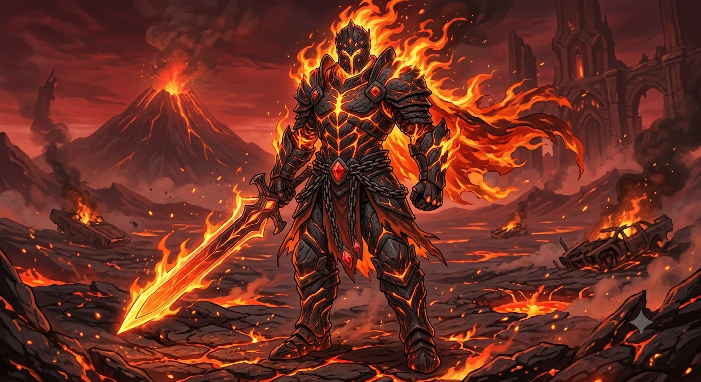
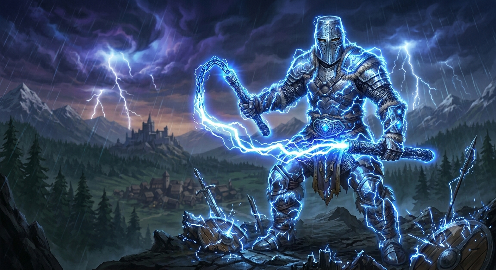
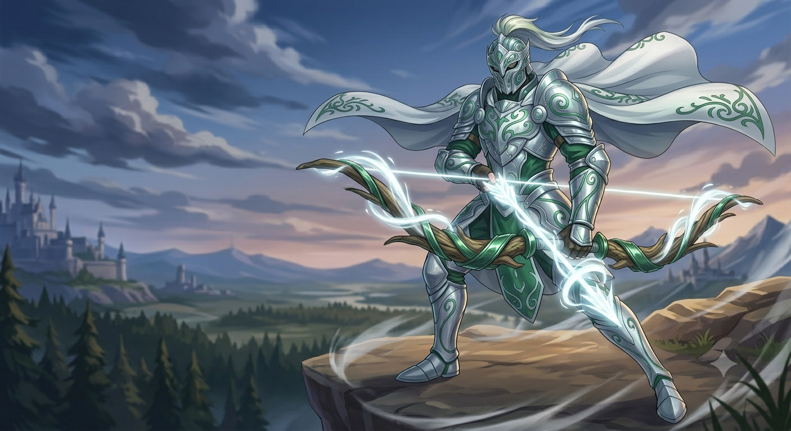
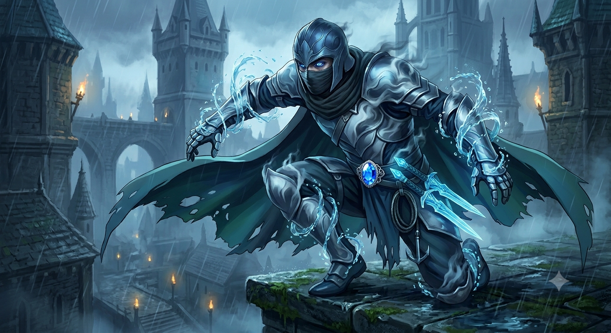

<!DOCTYPE html>
<html lang="en">
<head>
    <meta charset="UTF-8">
    <meta name="viewport" content="width=device-width, initial-scale=1.0">
    
    <title>Mezu and Knights - Manga by Irash</title>
    <meta name="description" content="Read Mezu and Knights, an epic manga written by Irash featuring funny jokes, sad moments, and epic fights of Mezu Fushira and his elemental knights!">
    <meta name="keywords" content="Mezu and Knights, Irash, Manga, Mezu Fushira, Fire Knight, Lightning Knight, Wind Knight, Water Knight">
    <meta name="author" content="Irash">

    
</head>
<body>

    <h1 class="anime-title">Mezu and Knights</h1>
    
    

        This is an manga written by <strong>Irash</strong>. It has funny jokes, sad moments, and epic fights! The main character of this manga is <strong>Mezu Fushira</strong>.
    

    <h2>Mezu and his knights</h2>
    
    
    <h3>This is Mezu</h3>
    
    
    <h4>Goki is the Fire Knight</h4>
    
His weapon is a sword. He can control fire.

    
    
    <h4>Raisen is the Lightning Knight</h4>
    
He has a nunchaku. He can control lightning.

    
    <h4>Gale is the Wind Knight</h4>
    
He has a wind bow and arrows. He can control wind.

    
    <h4>Torrent is the Water Knight</h4>
    
He has water knives. He can control water.

    

        <h3>Rate this Manga!</h3>
        

            ★
            ★
            ★
            ★
            ★
        

        <button class="submit-btn" id="submit-rating">Submit</button>
        
Rating Submitted! Thank you! ⭐

    

    

</body>
</html>
